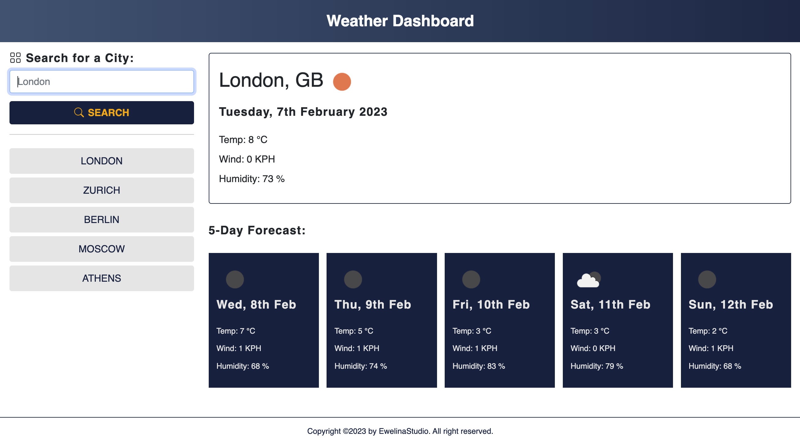

# Module 8 Server-Side APIs: Weather Dashboard

## Overview

Simple weather application that allows a user to search for a city and present
weather dashboard for that city (current day and forecast) Page runs in the
browser and feature dynamically updated HTML and CSS.

Application uses the
[5 Day Weather Forecast](https://openweathermap.org/forecast5) to retrieve
weather data for cities. The link should take you to a guide on how to use the 5
Day Forecast API. You will need to register for an API key in order to use this
API. After registering for a new API key, you may need to wait up to 2 hours for
that API key to activate.

Application uses the [Moment.js](https://momentjs.com/) library to work with
date and time. Be sure to read the documentation carefully and concentrate on
using Moment.js in the browser.

## Table of Contents

- [Installation](#installation)
- [Usage](#usage)
- [Requirements](#requirements)
- [Credits](#credits)
- [License](#license)

## Installation

Add Bootstrap library links right before your css and closing `</head>` tag in
html files:

```html
<link
  href="https://cdn.jsdelivr.net/npm/bootstrap@5.0.2/dist/css/bootstrap.min.css"
  rel="stylesheet"
  integrity="sha384-EVSTQN3/azprG1Anm3QDgpJLIm9Nao0Yz1ztcQTwFspd3yD65VohhpuuCOmLASjC"
  crossorigin="anonymous"
/>
<script
  src="https://cdn.jsdelivr.net/npm/bootstrap@5.0.2/dist/js/bootstrap.bundle.min.js"
  integrity="sha384-MrcW6ZMFYlzcLA8Nl+NtUVF0sA7MsXsP1UyJoMp4YLEuNSfAP+JcXn/tWtIaxVXM"
  crossorigin="anonymous"
></script>

<link
  rel="stylesheet"
  href="https://cdn.jsdelivr.net/npm/bootstrap-icons@1.10.3/font/bootstrap-icons.css"
/>
```

Add CSS right before closing `</head>` tag in html files (before title):

```html
<link rel="stylesheet" href="./styles.css" />
```

Add JavaScript right before closing `</body>` tag in the html file.

JQuery and MomentJS libraries:

```html
<script src="https://cdnjs.cloudflare.com/ajax/libs/jquery/3.2.1/jquery.min.js"></script>
<script src="https://cdnjs.cloudflare.com/ajax/libs/moment.js/2.24.0/moment.min.js"></script>
```

Your own script code:

```html
<script src="./script.js"></script>
```

## Usage

Output: https://eamrogowicz.github.io/weather-dashboard/

GitHub source files: https://github.com/EAmrogowicz/weather-dashboard

The following image shows the web application's appearance and functionality:



## Requirements

A weather dashboard with form inputs.

- When a user searches for a city they are presented with current and future
  conditions for that city and that city is added to the search history
- When a user views the current weather conditions for that city they are
  presented with:
  - The city name
  - The date
  - An icon representation of weather conditions
  - The temperature
  - The humidity
  - The wind speed
- When a user view future weather conditions for that city they are presented
  with a 5-day forecast that displays:
  - The date
  - An icon representation of weather conditions
  - The temperature
  - The humidity
- When a user click on a city in the search history they are again presented
  with current and future conditions for that city
- When user type invalid text, error message is displayed

## Credits

N/A

## License

Please refer to the LICENSE in the repo.
